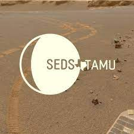

<!-- Improved compatibility of back to top link: See: https://github.com/othneildrew/Best-README-Template/pull/73 -->
<a name="readme-top"></a>
<!--
*** Thanks for checking out the Best-README-Template. If you have a suggestion
*** that would make this better, please fork the repo and create a pull request
*** or simply open an issue with the tag "enhancement".
*** Don't forget to give the project a star!
*** Thanks again! Now go create something AMAZING! :D
-->


<!-- PROJECT SHIELDS -->
<!--
*** I'm using markdown "reference style" links for readability.
*** Reference links are enclosed in brackets [ ] instead of parentheses ( ).
*** See the bottom of this document for the declaration of the reference variables
*** for contributors-url, forks-url, etc. This is an optional, concise syntax you may use.
*** https://www.markdownguide.org/basic-syntax/#reference-style-links
-->


[![Contributors][contributors-shield]][contributors-url]
[![Forks][forks-shield]][forks-url]
[![Stargazers][stars-shield]][stars-url]
[![Issues][issues-shield]][issues-url]


<!-- PROJECT LOGO -->
<br />
<div align="center">
  <a href="https://github.com/jose01carrillo30/TAMU-SEDS-HUB">
    
  </a>

  <h3 align="center">TAMU-SEDS-HUB</h3>

  <p align="center">
    TAMU SEDS HUB project!
    <br />
    <a href="https://github.com/jose01carrillo30/TAMU-SEDS-HUB"><strong>Explore the docs »</strong></a>
    <br />
    <br />
    <a href="https://tamu-seds.herokuapp.com/">View Demo</a>
    ·
    <a href="https://github.com/jose01carrillo30/TAMU-SEDS-HUB/issues">Report Bug</a>
    ·
    <a href="https://github.com/jose01carrillo30/TAMU-SEDS-HUB/issues">Request Feature</a>
  </p>
</div>


<!-- TABLE OF CONTENTS -->
<details>
  <summary>Table of Contents</summary>
  <ol>
    <li>
      <a href="#about-the-project">About The Project</a>
      <ul>
        <li><a href="#built-with">Built With</a></li>
      </ul>
    </li>
    <li>
      <a href="#getting-started">Getting Started</a>
      <ul>
        <li><a href="#installation">Installation</a></li>
      </ul>
    </li>
    <li><a href="#features">Features</a></li>
    <li><a href="#roadmap">Roadmap</a></li>
    <li><a href="#contributing">Contributing</a></li>
    <li><a href="#contact">Contact</a></li>
    <li><a href="#acknowledgments">Acknowledgments</a></li>
  </ol>
</details>


<!-- ABOUT THE PROJECT -->
## About The Project

This repository holds the source code for the TAMU SEDS Administration webpage.

This project is a part of the CSCE 431 Software Engineering class using the AGILE devleopement process.

Project Description: "You will work in a project group to complete a project, through an application of an engineering approach to computer software design and development. Every project requires complete implementation, documentation, and demonstration of the solution. The focus is not only on the final product but also on design methodology, management process, and teamwork. At the end of the semester, each group will make a public presentation to the class describing and demonstrating their work."

<p align="right">(<a href="#readme-top">back to top</a>)</p>


### Built With

This section should list any major frameworks/libraries used to bootstrap your project. Leave any add-ons/plugins for the acknowledgements section. Here are a few examples.

* [![Rails][Rails.org]][Rails-url]
* [![Postgres][Postgres.org]][Postgres-url]

<p align="right">(<a href="#readme-top">back to top</a>)</p>


<!-- GETTING STARTED -->
## Getting Started

This is an example of how you may give instructions on setting up your project locally.
To get a local copy up and running follow these simple example steps.

### Installation

This is an example of how you can install and setting up the app locally.
* Clone Repo
  ```sh
  git clone git@github.com:juliendargelos/project.git
  cd project
  ```
* Download Docker Cotainer
  ```sh
  docker pull dmartinez05/ruby_rails_postgresql:latest
  ```
* Run Docker
  ```sh
  docker run --rm -it --volume "${PWD}:/csce431" -e DATABASE_USER=test_app -e DATABASE_PASSWORD=test_password -p 3000:3000 dmartinez05/ruby_rails_postgresql:latest
  ```
* Instantiate the database
  ```sh
  rails db:create
  rails db:migrate
  ```
* Run the app
  ```sh
  rails server --binding=0.0.0.0
  ```
Check in the browser:
http://127.0.0.1:3000

<p align="right">(<a href="#readme-top">back to top</a>)</p>


<!-- FEATURES -->
## Features
* Roles
* Users
* Events
* Announcements 
* Dues
* Attendence Records

<p align="right">(<a href="#readme-top">back to top</a>)</p>


<!-- ROADMAP -->
## Roadmap

- [x] Sprint 1
- [x] Sprint 2
- [x] Sprint 3
- [ ] Project Turnover - *In Progress*

<p align="right">(<a href="#readme-top">back to top</a>)</p>


<!-- CONTRIBUTING -->
## Contributing

Contributions are what make the open source community such an amazing place to learn, inspire, and create. Any contributions you make are **greatly appreciated**.

If you have a suggestion that would make this better, please fork the repo and create a pull request. You can also simply open an issue with the tag "enhancement".
Don't forget to give the project a star! Thanks again!

1. Fork the Project
2. Create your Feature Branch (`git checkout -b feature/AmazingFeature`)
3. Commit your Changes (`git commit -m 'Add some AmazingFeature'`)
4. Push to the Branch (`git push origin feature/AmazingFeature`)
5. Open a Pull Request

<p align="right">(<a href="#readme-top">back to top</a>)</p>


<!-- CONTACT -->
## Contact

Product Lead - Jose Carrillo - jcarri877@tamu.edu

Scrum Master - Tyler Nichols

Members:
David Hung, Kelton Chesshire, Samuel He, Lily Wang

Project Link: [https://github.com/jose01carrillo30/TAMU-SEDS-HUB/](https://github.com/jose01carrillo30/TAMU-SEDS-HUB/)

<p align="right">(<a href="#readme-top">back to top</a>)</p>


<!-- ACKNOWLEDGMENTS -->
## Acknowledgments

Use this space to list resources you find helpful and would like to give credit to. I've included a few of my favorites to kick things off!

* [GitHub Emoji Cheat Sheet](https://www.webpagefx.com/tools/emoji-cheat-sheet)
* [Malven's Grid Cheatsheet](https://grid.malven.co/)
* [Img Shields](https://shields.io)
* [GitHub Pages](https://pages.github.com)
* [Font Awesome](https://fontawesome.com)

<p align="right">(<a href="#readme-top">back to top</a>)</p>


<!-- MARKDOWN LINKS & IMAGES -->
<!-- https://www.markdownguide.org/basic-syntax/#reference-style-links -->
[contributors-shield]: https://img.shields.io/github/contributors/jose01carrillo30/TAMU-SEDS-HUB.svg?style=for-the-badge
[contributors-url]: https://github.com/jose01carrillo30/TAMU-SEDS-HUB/graphs/contributors
[forks-shield]: https://img.shields.io/github/forks/jose01carrillo30/TAMU-SEDS-HUB.svg?style=for-the-badge
[forks-url]: https://github.com/jose01carrillo30/TAMU-SEDS-HUB/network/members
[stars-shield]: https://img.shields.io/github/stars/jose01carrillo30/TAMU-SEDS-HUB.svg?style=for-the-badge
[stars-url]: https://github.com/jose01carrillo30/TAMU-SEDS-HUB/stargazers
[issues-shield]: https://img.shields.io/github/issues/jose01carrillo30/TAMU-SEDS-HUB.svg?style=for-the-badge
[issues-url]: https://github.com/jose01carrillo30/TAMU-SEDS-HUB/issues
[license-shield]: https://img.shields.io/github/license/jose01carrillo30/TAMU-SEDS-HUB.svg?style=for-the-badge
[license-url]: https://github.com/jose01carrillo30/TAMU-SEDS-HUB/blob/master/LICENSE.txt
[linkedin-shield]: https://img.shields.io/badge/-LinkedIn-black.svg?style=for-the-badge&logo=linkedin&colorB=555
[linkedin-url]: https://linkedin.com/
[product-screenshot]: images/homepage.JPG
[Rails.org]: https://img.shields.io/badge/rails-%23CC0000.svg?style=for-the-badge&logo=ruby-on-rails&logoColor=white
[Rails-url]: https://rubyonrails.org/
[Postgres.org]: https://img.shields.io/badge/postgres-%23316192.svg?style=for-the-badge&logo=postgresql&logoColor=white
[Postgres-url]: https://www.postgresql.org/
[Next.js]: https://img.shields.io/badge/next.js-000000?style=for-the-badge&logo=nextdotjs&logoColor=white
[Next-url]: https://nextjs.org/
[React.js]: https://img.shields.io/badge/React-20232A?style=for-the-badge&logo=react&logoColor=61DAFB
[React-url]: https://reactjs.org/
[Vue.js]: https://img.shields.io/badge/Vue.js-35495E?style=for-the-badge&logo=vuedotjs&logoColor=4FC08D
[Vue-url]: https://vuejs.org/
[Angular.io]: https://img.shields.io/badge/Angular-DD0031?style=for-the-badge&logo=angular&logoColor=white
[Angular-url]: https://angular.io/
[Svelte.dev]: https://img.shields.io/badge/Svelte-4A4A55?style=for-the-badge&logo=svelte&logoColor=FF3E00
[Svelte-url]: https://svelte.dev/
[Laravel.com]: https://img.shields.io/badge/Laravel-FF2D20?style=for-the-badge&logo=laravel&logoColor=white
[Laravel-url]: https://laravel.com
[Bootstrap.com]: https://img.shields.io/badge/Bootstrap-563D7C?style=for-the-badge&logo=bootstrap&logoColor=white
[Bootstrap-url]: https://getbootstrap.com
[JQuery.com]: https://img.shields.io/badge/jQuery-0769AD?style=for-the-badge&logo=jquery&logoColor=white
[JQuery-url]: https://jquery.com 
